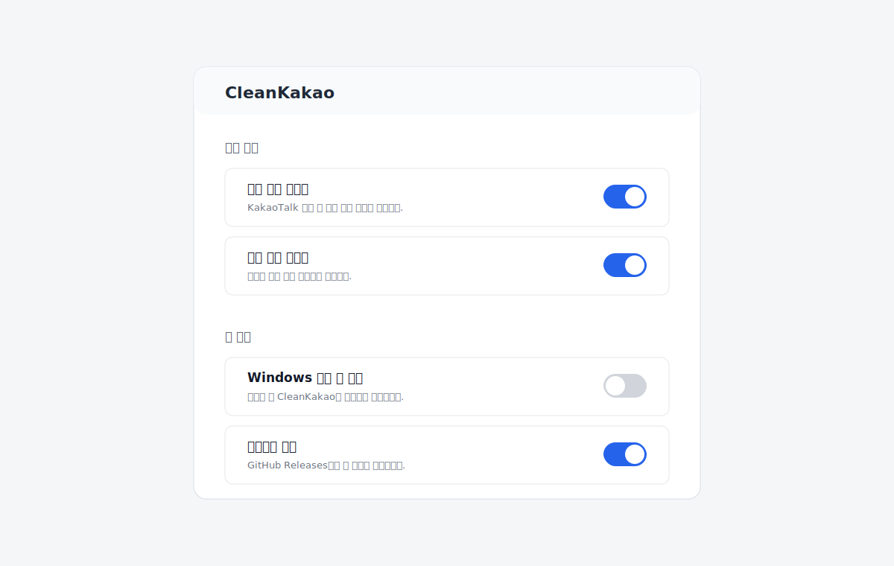

# CleanKakao

CleanKakao는 Windows용 KakaoTalk PC 클라이언트의 광고 영역을 숨기고, 비워진 공간을 채워 주는 시스템 트레이 앱입니다.

## 스크린샷



## 다운로드

최신 버전은 [GitHub Releases](https://github.com/ghostface2232/cleankakao/releases/latest)에서 받을 수 있습니다.

## 기능

- KakaoTalk PC 메인 창의 배너 광고 영역 숨김
- 광고가 사라진 뒤 대화 목록/콘텐츠 영역 재배치
- 트레이 아이콘에서 차단 켜기/끄기
- 설정 창에서 배너/팝업 차단, 자동 시작, 업데이트 확인 설정
- KakaoTalk 창 복원/재표시 시 광고 영역 자동 재검사
- GitHub Releases 기반 업데이트 확인 및 Windows Toast 알림

## 사용법

1. Releases에서 `cleankakao-v*-x86_64.zip`을 다운로드합니다.
2. 압축을 풀고 `cleankakao.exe`를 실행합니다.
3. 트레이 아이콘 메뉴에서 차단 상태를 전환하거나 설정 창을 엽니다.
4. 자동 시작이 필요하면 설정 창에서 활성화합니다.

## 빌드

필수 조건:

- Rust 1.95 이상
- Windows 10/11
- MSVC toolchain
- Windows SDK resource compiler

개발 실행:

```powershell
cargo run
```

릴리스 빌드:

```powershell
cargo build --release --target x86_64-pc-windows-msvc
```

태그를 푸시하면 GitHub Actions가 Windows 릴리스 빌드를 만들고 zip 파일을 GitHub Release에 업로드합니다.

```powershell
git tag v0.1.0
git push origin v0.1.0
```

## 참고 및 감사

CleanKakao는 [blurfx/KakaoTalkAdBlock](https://github.com/blurfx/KakaoTalkAdBlock)의 아이디어와 구현 접근에서 영향을 받았습니다. CleanKakao는 별도의 Rust 구현이며, 독립적인 구조와 코드베이스를 사용합니다.

## 라이선스

MIT License. 자세한 내용은 [LICENSE](LICENSE)를 참고하세요.

## 면책 조항

CleanKakao는 Kakao Corp. 또는 KakaoTalk와 무관한 비공식 서드파티 도구입니다. 사용자는 본 도구 사용으로 발생할 수 있는 모든 결과를 스스로 판단하고 책임져야 합니다.
